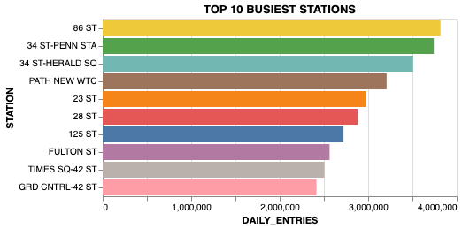
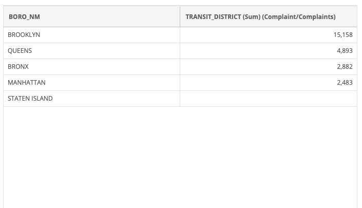

## Initial Analysis of Crime in the NY Transit District (MTA)

The purpose of the project is to determine where and when to best deploy additional police
officers in the NYPD Transit District using MTA turnstile data.

The initial step was to determine the busiest stations based on daily entries.

This plot was generated by aggregating daily turnstile data and grouping them by station.

The next step was to determine the number count of crimes committed in each of the boroughs covered by the MTA. 

Notice that since the the NYPD does not directly service Staten Island and as such there is no corresponding Transit crime data. 

Although the busiest stations are mostly located in Manhattan, total crimes for that borough only account for 10% of the total crimes. 
60% of transit crimes are commited in Brooklyn.